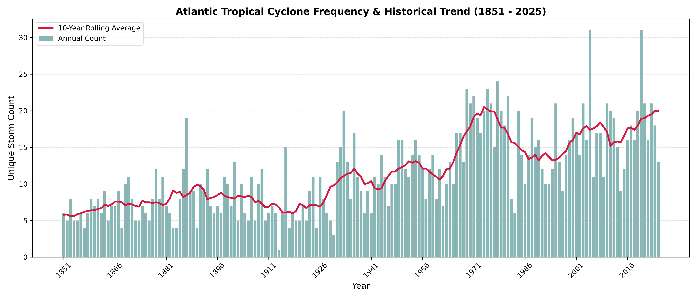
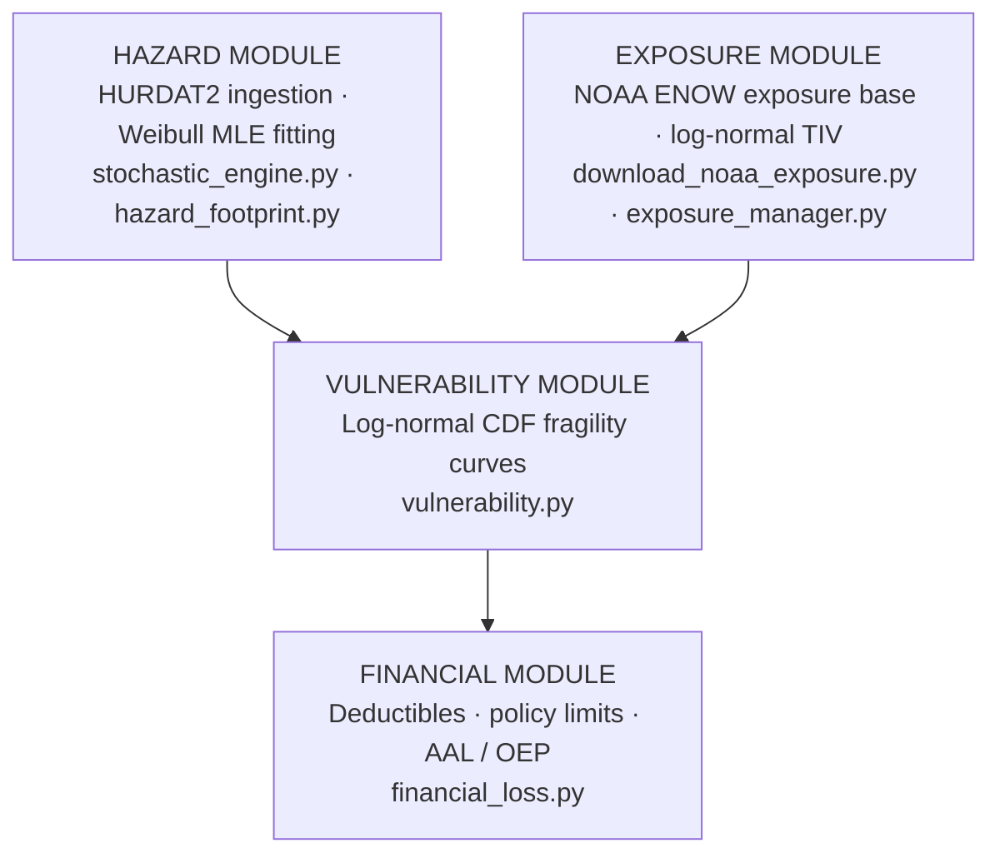
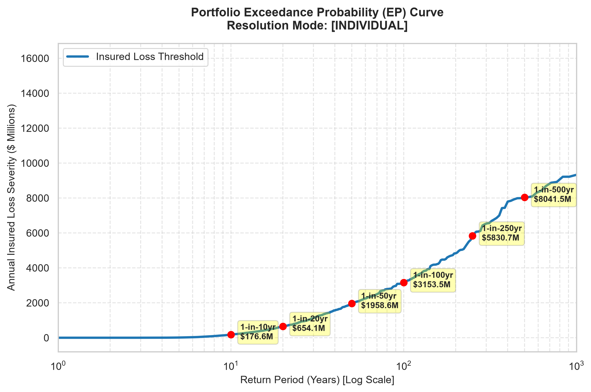
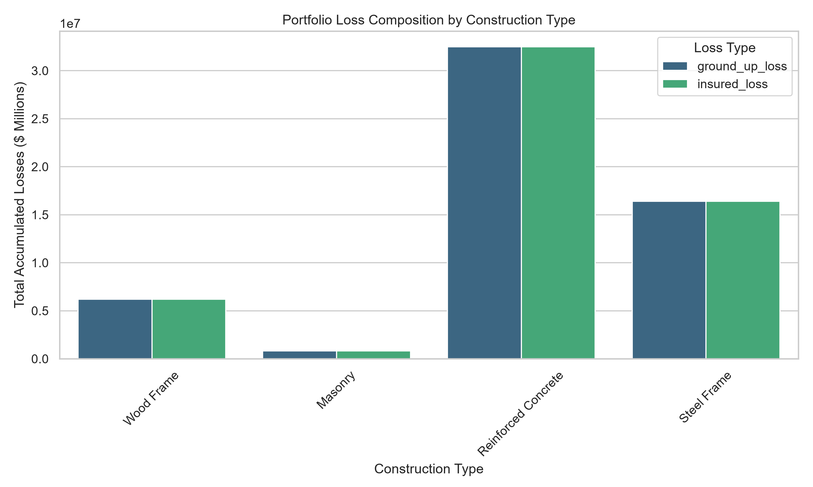
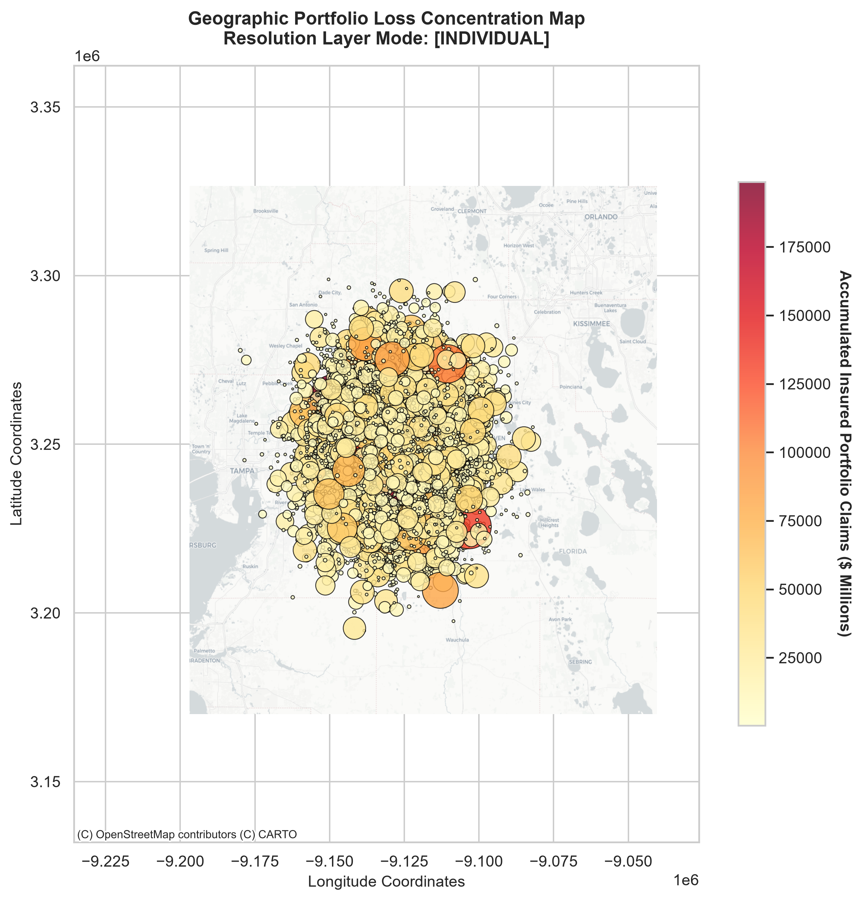

# Probabilistic Catastrophe Risk Model for Hurricane Loss Quantification

An end-to-end Python framework for modeling property catastrophe tail risk over a 10,000-year stochastic horizon, using extreme value statistics, vectorized geospatial arrays, and a streaming financial loss engine.

---

## Historical Context: Why Simulation Is Necessary


*Geographic distribution of historical North Atlantic tropical cyclone tracks, NOAA HURDAT2.*


*Annual North Atlantic storm counts, NOAA HURDAT2. Part of the upward trend reflects improved satellite-era detection capability after ~1970 rather than a confirmed climate signal alone; see the Discussion section of the accompanying [technical paper](CatRisk_hurricane_arxiv_v2.tex) for a fuller treatment.*

These two patterns motivate the modeling approach below: the historical record is short, spatially uneven, and partly shaped by detection-era artifacts, so tail risk has to be estimated through simulation rather than read directly off ~170 years of observations.

---


## Architecture: The Four Pillars



### 1. Hazard Module
`src/stochastic_engine.py`, `src/hazard_footprint.py`

- Fits a continuous **Weibull distribution** (via `scipy.stats`) to historical North Atlantic hurricane peak winds from NOAA HURDAT2, enabling simulation of extreme events (up to Category 5, 165 kt) beyond the historical record.
- Dual resolution modes, set in `config.yaml`:
  - `spatial` — wind decay evaluated against regional macro-anchors.
  - `individual` — explicit track vectors intercepted against every property.
- Wind field attenuation uses a Haversine-distance Holland-style falloff, scaled by Radius of Maximum Winds (`r_max_km`) and decay coefficient (`alpha_decay`).

### 2. Exposure Module
`src/download_noaa_exposure.py`, `src/exposure_manager.py`

- Builds a realistic Industry Exposure Database by downloading NOAA Digital Coast **Coastal Economy (ENOW)** data.
- County-level GDP weights drive the spatial allocation of 10,000 synthetic properties across high-hazard coastal counties (Miami-Dade, Harris, Orleans, Charleston, etc.).
- Property values are drawn from a right-skewed **log-normal** distribution, with construction class (Wood Frame, Masonry, Steel Frame, Reinforced Concrete) and occupancy type assigned per property.

### 3. Vulnerability Module
`src/vulnerability.py`

- Converts local wind speed into a **Mean Damage Ratio** (MDR ∈ [0, 1]) via log-normal CDF fragility curves.
- Curve parameters (median failure threshold, dispersion) are defined per construction class in `config.yaml`.

### 4. Financial Module
`src/financial_loss.py`

- Applies fixed-dollar deductibles and policy limit caps to ground-up loss to compute net insured liability.
- Aggregates the simulation into:
  - **Average Annual Loss (AAL)** — long-term expected burn cost.
  - **Occurrence Exceedance Probability (OEP) curve** — capital required to survive 1-in-N year events.

---

## Performance: Handling 500M+ Simulated Interactions

A 10,000-year catalog evaluated against a multi-thousand-property portfolio produces over 500 million event-asset interaction rows — enough to trigger out-of-memory errors in a naive pandas pipeline. Three engineering choices keep this tractable:

| Technique | Implementation | Result |
|---|---|---|
| **Disk-streamed Parquet** | `pyarrow.ParquetFile.iter_batches()` reads/writes in chunks of up to 5,000,000 rows | Peak RAM stays flat under **50 MB** |
| **Snappy compression** | Columnar binary storage replaces CSV | 1.5 GB → **~120 MB** on disk, no precision loss |
| **SIMD vectorization** | `np.where`, `np.maximum`, `np.minimum` replace `iterrows()` | Compiled C-level array math instead of Python loops |

---

## Results

**Occurrence Exceedance Probability curve** — insured loss severity by return period:



**Loss composition by construction class** — ground-up vs. insured loss:



**Geographic accumulation of insured loss across the portfolio:**



---

## Setup

```bash
pip install numpy pandas scipy pyyaml pyarrow tqdm matplotlib seaborn contextily
```

## Configuration

All model behavior is controlled centrally in `config.yaml`:

```yaml
model_settings:
  resolution_mode: "individual"   # "spatial" or "individual"

financial:
  policy_limit_pct: 0.90
  deductibles:
    residential_fixed_usd: 2500.0
    commercial_fixed_usd: 15000.0
```

## Running the Pipeline

Each stage reads the previous stage's output, so run them in order:

```bash
python -m src.download_noaa_exposure   # Pull NOAA ENOW county GDP data
python -m src.exposure_manager         # Build the synthetic property portfolio
python -m src.stochastic_engine        # Generate the 10,000-year event catalog
python -m src.hazard_footprint         # Compute per-property wind footprints
python -m src.vulnerability            # Convert wind speed to damage ratio
python -m src.financial_loss           # Apply policy terms, compute insured loss
python -m src.visualize_results        # Generate all output plots
```

## References

- Clark, K. M. (1986). *Use of Computer Simulation Modeling in Estimating Insurance Disaster Losses.* The Journal of Insurance Regulation, 5, 23–35.
- Friedman, D. G. (1984). *Natural Hazard Risk Assessment for an Insurance Program.* The Geneva Papers on Risk and Insurance, 9(1), 57–81.
- Holland, G. J. (1980). *An Analytical Model of the Wind and Pressure Profiles in Hurricanes.* Monthly Weather Review, 108(8), 1212–1218.
- Strupczewski, W. G., Singh, V. P., & Feluch, W. (2001). *Non-stationary approach to selection of a flood frequency distribution.* Journal of Hydrology, 248(1-4), 123–142.
- Woo, G. (2011). *Calculating Catastrophe.* Imperial College Press.
- NOAA National Hurricane Center. *HURDAT2 Tropical Cyclone Dataset.*
- NOAA Office for Coastal Management. *Economics: National Ocean Watch (ENOW).*

---

> **Note:** This framework was developed with the help of various Generative AI tools. Please review and validate the methodology and code before relying on it. Feedback, critique, and discussion are very welcome.